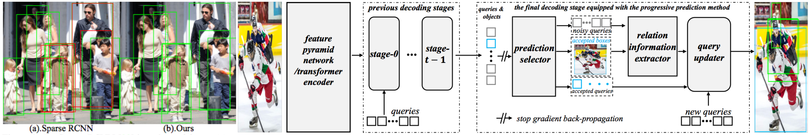

## Progressive End-to-End Object Detection in Crowded Scenes

[](https://opensource.org/licenses/MIT)



## Introduction

In this paper, we propose a new query-based detection framework for crowd detection. Previous query-based detectors suffer from two drawbacks: first, multiple predictions will be inferred for a single object, typically in crowded scenes; second, the performance saturates as the
depth of the decoding stage increases. Benefiting from the nature of the one-to-one label assignment rule, we propose a progressive predicting method to address the above issues. Specifically, we first select accepted queries prone to generate true positive predictions, then refine the rest
noisy queries according to the previously accepted predictions. Experiments show that our method can significantly boost the performance of query-based detectors in crowded scenes. Equipped with our approach, Sparse RCNN achieves 92.0% AP, 41.4% MR^−2 and 83.2% JI on the challenging [CrowdHuman](https://www.crowdhuman.org/) dataset, outperforming the box-based method MIP that specifies in handling crowded scenarios. Moreover, the proposed method, robust to crowdedness, can still obtain consistent improvements on moderately and slightly crowded datasets like CityPersons and COCO. __The code for Iter deformable DETR implementation can also be found [here](https://github.com/zyayoung/Iter-Deformable-DETR.git).__

## Models

Experiments of different methods were conducted on CrowdHuman. All approaches take [R-50](detectron2://ImageNetPretrained/torchvision/R-50.pkl) as the backbone.
Method | #queries | AP | MR | JI 
:---:|:---:|:---:|:---:|:---:
[CrowdDet](https://openaccess.thecvf.com/content_CVPR_2020/papers/Chu_Detection_in_Crowded_Scenes_One_Proposal_Multiple_Predictions_CVPR_2020_paper.pdf) | -- | 90.7 | 41.4 | 82.4
Sparse RCNN | 500 | 90.7 | 44.7 | 81.4 
Deformable DETR | 1000 | 91.5 | 43.7 | 83.1
Sparse RCNN + Ours | 500 | 92.0 | 41.4 | 83.2
Deformable DETR + Ours | 1000 | 92.1 | 41.5 | 84.0
## Installation
The codebases are built on top of [Detectron2](https://github.com/facebookresearch/detectron2) and [Sparse RCNN](https://github.com/PeizeSun/SparseR-CNN).

#### Requirements
- Linux or macOS with Python ≥ 3.6
- PyTorch ≥ 1.5 and [torchvision](https://github.com/pytorch/vision/) that matches the PyTorch installation.
  You can install them together at [pytorch.org](https://pytorch.org) to make sure of this
- OpenCV is optional and needed by demo and visualization

#### Steps
1. Install and build libs
```
git clone https://github.com/megvii-model/Iter-E2EDET.git
cd Iter-E2EDET
python3 setup.py build develop
```

2. Load the CrowdHuman images from [here](https://www.crowdhuman.org/download.html) and its annotations from [here](https://drive.google.com/file/d/11TKQWUNDf63FbjLHU9iEASm2nE7exgF8/view?usp=sharing). Then update the directory path of the CrowdHuman dataset in the config.py.
```
vim config.py
imgDir = 'CrowdHuman/images'
json_dir = 'CrowdHuman/annotations'
```

3. Train Iter SparseR-CNN
```
python3 train_net.py --num-gpus 8 \
    --config-file configs/50e.6h.500pro.ignore.yaml

```

4. Evaluate Iter SparseR-CNN. You can download the pre-trained model from [here](https://drive.google.com/file/d/1LTP-Qfe6QsnhCOL3e-lxuuXEqfJ55sgj/view?usp=sharing) for direct evaluation.
```
-- python3 train_net.py --num-gpus 8 \
    --config-file configs/50e.6h.500pro.ignore.yaml \
    --eval-only MODEL.WEIGHTS path/to/model.pth
```

## License

Iter Sparse RCNN is released under MIT License.


## Citing

If you use our work in your research or wish to refer to the baseline results published here, please use the following BibTeX entries:

```BibTeX
@article{2022iterdetr,
  title   =  {Progressive End-to-End Object Detection in Crowded Scenes},
  author  =  {Anlin Zheng and Yuang Zhang and Xiangyu Zhang and Xiaojuan Qi and Jian Sun},
  journal =  {arXiv preprint arXiv:arXiv:2203.07669v1},
  year    =  {2022}
}
```

